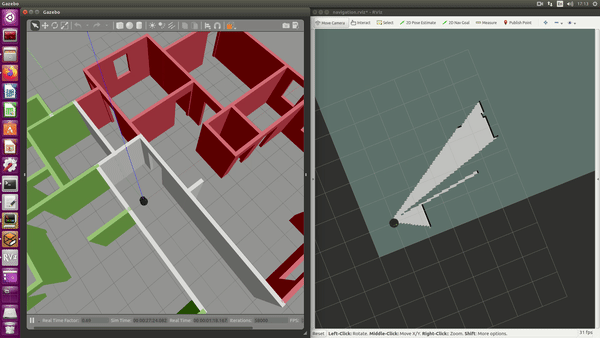
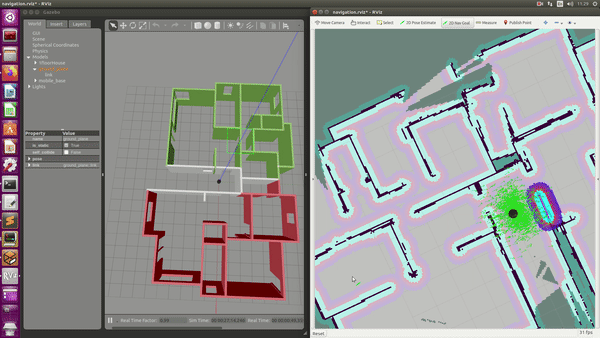

# RoboND-HomeServiceRobot
Udacity Robotics Nanodegree Term 2 Project: Home Service Robot Project.

In this project I have:
1. modelled a real world 2 apartments floor with the Building Editor in Gazebo.
2. mapped the environment teleoperating the robot (SLAM).
3. used the ROS navigation stack to move the robot towards a 2D Nav Goal manually imposed from rviz.
4. Write a pick_objects node that commands your robot to move to the desired pickup and drop off zones.

## Project Setup
For this setup, catkin_ws is the name of the active ROS workspace. If your workspace name is different, change the commands accordingly.

```sh
mkdir -p ~/catkin_ws/src
cd ~/catkin_ws/
git clone https://github.com/kevinfructuoso/home-service-bot.git src
rosdep install --from-paths src --ignore-src -y
catkin build
source devel/setup.bash
```


## Run the project
Different scripts are available under the scripts directory to launch the project.

- run *scripts/test_slam.sh* if you want to map an environment

- run *scripts/test_navigation.sh* if you want to send from rviz the goal pose to the robot

- run *scripts/home_service.sh* if you want to see the robot going to a predefined location picking up an object and than dropping it off at a predefined drop off location.


Now a brief description of the ros-packags launched within each script is reported.

### test_slam.sh
Using this script is possible to map the floor plan by manually driving the robot in it.
Running the script 5 different terminals will show up and in each terminal a different launch file will be called:

- roslaunch turtlebot_gazebo turtlebot_world.launch. It loads the custom designed apartment world in gazebo and it spawns a turtlebot at the entrance.
- roslaunch turtlebot_teleop xbox360_teleop.launch. It enables the control of the simulated robot using a xbox360 controller.
- roslaunch turtlebot_rviz_launchers view_navigation.launch. It starts the visual interface to monitor the simulation from RVIZ.
- roslaunch turtlebot_gazebo gmapping_demo.launch. This launch file start the gmapping node. Gmapping is the core of the mapping process and it is based on fast slam and it creates a 2-D occupancy grid map (like a building floorplan) from laser and pose data collected by a mobile robot.

### test_navigation.sh
Using this script is possible to set a goal location for the robot using rviz goal button. Once a goal pose is setted the robot plan and move thorowards the defined goal pose.
This script open 3 different terminals launching the following 3 launch files:

- roslaunch turtlebot_gazebo turtlebot_world.launch. (see test_slam.sh).
- roslaunch turtlebot_rviz_launchers view_navigation.launch. (see test_slam.sh).
- roslaunch turtlebot_gazebo amcl_demo.launch. In this launch file the montecarlo localization is started togheter with the move_base package responsable of computing the path to bring the robot from its starting position to a custom end pose selected using rviz. The move_base package is composed by  Dijkstra's based global planner (navfn) and by a Trajectory Rollout and Dynamic Window Approach based local planner (base_local_planner).

### home_service.sh
- roslaunch turtlebot_gazebo turtlebot_world.launch (see test_slam.sh)
- roslaunch turtlebot_rviz_launchers view_navigation.launch (see test_slam.sh)
- roslaunch turtlebot_gazebo amcl_demo.launch (see test_navigation.sh)
- rosrun pick_objects pick_objects_node. This is a custom developed node and it sends to the planner the locations where the robot has to pickup and droppoff the object.
- rosrun add_markers add_markers_node. This is a custom developed node and it is needed to visualize the pickup and drop off location in rviz, to help debugging eventual problems and produce a nicer rviz visualization. 